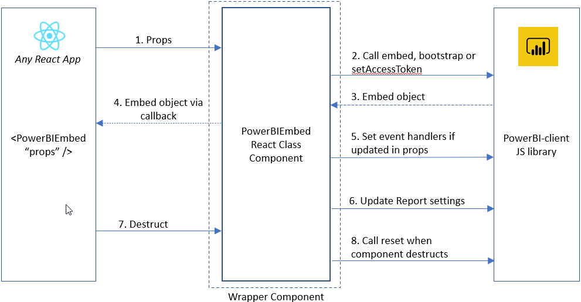

# powerbi-client-react
Power BI React component. This library lets you embed Power BI report, dashboard, dashboard tile, report visual, or Q&A in your React application.

## Quick Start

## Import

```jsx
import { PowerBIEmbed } from 'powerbi-client-react';
```

## Embed a Power BI report
```jsx
<PowerBIEmbed
	embedConfig = {{
		type: 'report',   // Supported types: report, dashboard, tile, visual and qna
		id: '<Report Id>',
		embedUrl: '<Embed Url>',
		accessToken: '<Access Token>',
		tokenType: models.TokenType.Embed,
		settings: {
			panes: {
				filters: {
					expanded: false,
					visible: false
				}
			},
			background: models.BackgroundType.Transparent,
		}
	}}

	eventHandlers = { 
		new Map([
			['loaded', function () {console.log('Report loaded');}],
			['rendered', function () {console.log('Report rendered');}],
			['error', function (event) {console.log(event.detail);}]
		])}
		
	cssClassName = { "report-style-class" }

	getEmbed = { (embeddedReport) => {
		this.report = embeddedReport as Report;
	}}
/>
```

### How to [bootstrap a PowerBI report](https://aka.ms/PbieBootstrap):
```jsx
<PowerBIEmbed
	embedConfig = {{
		type: 'report',   // Supported types: report, dashboard, tile, visual and qna
		id: undefined, 
		embedUrl: undefined,
		accessToken: undefined,    // Keep as empty string, null or undefined
		tokenType: models.TokenType.Embed
	}}
/>
```
Note: To embed the report after bootstrap, update the props (with atleast accessToken).

## Demo

A React application that embeds a sample report using the _PowerBIEmbed_ component.<br/>
It demonstrates the complete flow from bootstrapping the report, to embedding and updating the embedded report.

To run the demo on localhost, run the following commands:

```
npm run install:demo
npm run demo
```

Redirect to http://localhost:8080/ to view in the browser.

## Flow Diagram for the Wrapper Component:


## Usage
|Use case|Details|
|:------|:------|
|Embed Power BI|To embed your powerbi artifact, pass the component with atleast _type_, _embedUrl_ and _accessToken_ in _embedConfig_ prop.|
|Get reference to the embedded object|Pass a callback method which accepts the embedded object as parameter to the _getEmbed_ of props.<br/>Refer to the _getEmbed_ prop in [Quick Start](#Quick-Start).|
|Apply style class|Pass the name(s) of classes to be set as "classname" for the embed container div via _className_ of props.|
|Set event handlers|Pass a map object of event name (string) and event handler (function) to the _eventHandlers_ of props. <br/>Key: Event name <br/>Value: Method to be triggered|
|Reset event handlers|To reset event handler for an event, set the event handler's value as `null` in the _eventHandlers_ map of props.|
|Set new accessToken|To set new accessToken in the same embedded powerbi artifact, pass the updated _accessToken_ in _embedConfig_ of props.<br/>Example scenario: _Current token has expired_.|
|Update settings (Report type only)|To update the report settings, update the _embedConfig.settings_ property of props.<br/>Refer to the _embedConfig.settings_ prop in [Quick Start](#Quick-Start).|
|Bootstrap Power BI|To [bootstrap your powerbi entity](https://aka.ms/PbieBootstrap), pass the props to the component without _accessToken_ in _embedConfig_.<br/>__Note__: _embedConfig_ of props should atleast contain __type__ of the powerbi entity being embedded. <br/>Available types: "report", "dashboard", "tile", "visual" and "qna".<br/>Refer to _How to bootstrap a report_ section in [Quick Start](#Quick-Start).|

Note: __Power BI report authoring APIs__ and __phased embedding__ are not supported with powerbi-client-react.

### Props interface

```ts
interface EmbedProps {

	// Configuration for embedding the PowerBI entity (required)
	embedConfig: IEmbedConfiguration | IQnaEmbedConfiguration

	// Callback method to get the embedded PowerBI entity object (optional)
	getEmbed?: { (embeddedComponent: Embed): void }

	// Map of pair of event name and its handler method to be triggered on the event (optional)
	eventHandlers?: Map<string, service.IEventHandler<any> | null>

	// CSS class to be set on the embedding container (optional)
	cssClassName?: string

	// Provide a custom implementation of PowerBI service (optional)
	service?: service.Service
}
```

## Dependencies
[powerbi-client](https://www.npmjs.com/package/powerbi-client)

## Peer dependencies
[react](https://www.npmjs.com/package/react)
